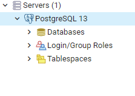
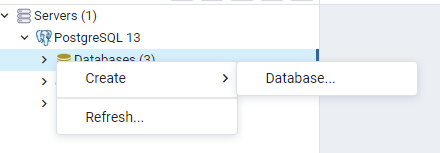
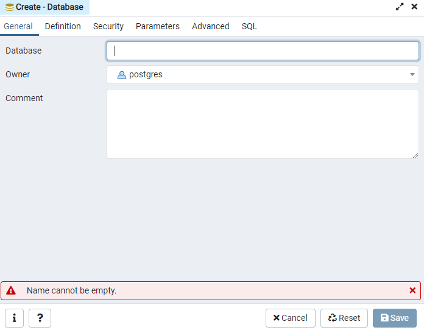
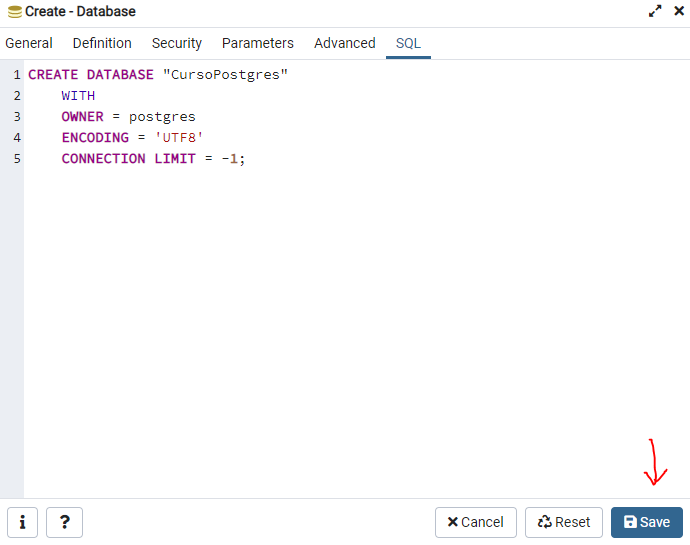
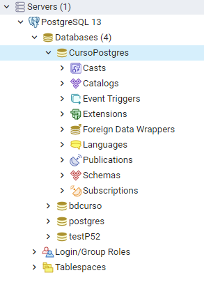

# Curso PostgreSQL

##### Autor: Luis Fernando Apáez Álvarez

---

### Creación de una base de datos

Una vez que hemos abierto _pgAdmin_, en la página principal daremos click en _Servers_, de donde nos aparecerá que el servidor es _PostgreSQL 13_ (u otro número, dependiendo de la versión que se haya descargado)

De ahí daremos click derecho en _Databases_ y después en _create_ y pulsaremos en _DATABASE..._

Noa aparecerá una ventana, lo primero que debemos hacer es colocar el nombre que queremos darle a la base de datos

vemos que hay 6 pestañas en la ventana. Por ahora no indagaremos en lo que se puede hacer en cada una, salvo con la pestaña _SQL_. 

En nuestro caso hemos nombrado la base de datos como _CursoPostgres_. En la pestaña _SQL_ se encuentra el código SQL con lo cual crearemos nuestra base de datos

Por el momento tampoco veremos a detalle todo lo que significa dicho código, en esta clase sólo nos centraremos en cómo crear una base de datos desde _pgAdmin_. Luego, daremos click en el botón _Save_ para guardar nuestra base de datos.

La cual ya aparecerá en _DATABASES_

Una vez que demos click en _CursoPostgres_ se mostrarán varios elementos de nuestra base de datos

donde la mayaría de ellos se verán en clases posteriores.

Así es como se puede crear una base de datos en _pgAdmin_, donde utilizamos un menú y una ventana que nos ayudaron a crearla. Como vimos, para crearla no fue necesario tener conocimiento en el lenguaje SQL pues en _pgAdmin_ fuimos guiados en todo momento. No obstante, en otros SMBD como _SQLserver_ podemos crear la base de datos desde una _consola SQL_ (o Query console), no obstante, en este curso sólo nos centraremos a trabajar en _pgAdmin_.

