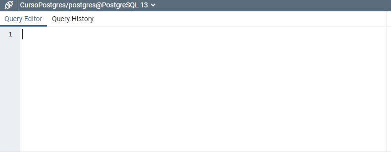

# Curso PostgreSQL

##### Autor: Luis Fernando Apáez Álvarez


### Creación de tablas


Una vez que ya creamos nuestra base de datos nos iremos a la parte que dice _Schemas_ (esquemas) 


donde en automático se creó el esquema _public_ el cual será en el que trabajaremos. Además podemos ver otras opciones, las cuales representan la materia prima de este curso, es decir, a lo largo del curso abordaremos la creación de tablas, funciones, triggers, procedimientos, manejaremos secuencias, crearemos vistas, etcétera.

Ahora bien, en _public_ daremos click derecho y después seleccionaremos donde dice _Query tool_


lo que nos desplegará una ventana a la derecha donde podremos trabajar propiamente con el lenguaje SQL



Antes de crear nuestra primer tabla es preciso que definamos un proyecto en el cual trabajaremos a lo largo de este curso para que éste vaya tomando forma. Elegimos trabajar en una base de datos referente a una papelería.

Con base en lo anterior consideramos, inicialmente, las siguientes tres tablas:

* Productos: esta tabla almacenará todos los productos que se venden en la papelería
* Empleados: esta tabla almacenará todos los empleados de la papelería
* Ventas: esta tabla almacenará todas las ventas efectuadas en la papelería

Ahora bien, la sintaxis para crear una tabla es la siguiente

```sql
CREATE TABLE <<nombre de la tabla>>(
	<<nombre columna 1>>  <<tipo de dato>>,
	<<nombre columna 2>>  <<tipo de dato>>,
	.
	.
	.
	<<nombre columna n>>  <<tipo de dato>>);
```

A partir de lo anterior abordamos el siguiente subtema:

##### Tipo de datos

Podemos utilizar datos nativos de PostgreSQL para almacenar nuestros valores. Por ejemplo, si deseamos almacenar un entero como el 7, utilizaremos para ello el tipo de dato ``INT`` (integer); si deseamos almacenar un nombre como 'Luis' (note que las cadenas de texto deben ir entre comillas simples) utilizaremos el tipo de dato, por ejemplo, ``VARCHAR``. Así, tendremos gran variedad de tipos de datos de acuerdo a la necesidad de los valores que queramos almacenar.

Para la tabla ``Productos`` ocuparemos 4 columnas:

* nombre_producto: nótese primero que en el nombre de la columna no podemos dejar espacios vacíos, en su lugar nos auxiliamos del diagonal bajo. Luego, en esta columna pondremos el nombre de los productos de la papelería, así, el tipo de dato adecuado será ``VARCHAR``.
* cantidad_almacen: nótese que en el nombre de las columnas no ponemos acentos. Luego, en esta columna pondremos la cantidad total de cada producto que se dispone en la papelería. Por ello utilizaremos el tipo de dato ``INT``
* precio: dado que el precio de un producto puede ser algo como 20.50, utilizaremos el tipo de dato ``real`` que hace referencia a los números reales.

La última columna es la más importante de todas, que de hecho se debe definir primero, y esta es independiente del contexto de la tabla. Es decir, esta columna debe ponerse en la mayoría de todas las tablas que definamos y la cual nos servirá para identificar cada fila de nuestra tabla de forma eficiente. Imaginemos que en la tabla ``Productos`` tenemos algo como

| nombre_producto | cantidad_almacen | precio |
| --------------- | ---------------- | ------ |
| Lápiz Big       | 20               | 0.50   |
| Lápiz Pelikan   | 2                | 1.00   |

si bien al colocar la marca del lápiz hemos evitado el siguiente conflicto

| nombre_producto | cantidad_almacen | precio |
| --------------- | ---------------- | ------ |
| Lápiz           | 20               | 0.50   |
| Lápiz           | 2                | 1.00   |

tenemos que la opción de poner la marca no es la más eficiente, donde el concepto de _eficiencia_ en base de datos es crucial pues recordemos que en la vida real las bases de datos tienes millones de filas.

Así, si tenemos en su lugar un identificador (``id``) para cada fila podremos manejar sin problemas tablas del estilo:

| id_producto | nombre_producto | cantidad_almacen | precio |
| ----------- | --------------- | ---------------- | ------ |
| 1           | Lápiz           | 20               | 0.50   |
| 2           | Lápiz           | 2                | 1.00   |

lo cual nos permitiría identificar dos tipos de lápiz aunque el nombre sea el mismo.

Si bien, con la última versión de la tabla ``productos`` seguimos teniendo una tabla que puede ser mejorada, el punto es dar la idea de porqué es importante tener un identificador en la mayoría de las tablas, con lo cual conseguimos un buen manejo de los datos que se almacenan en dicha tabla. Por ende consideramos la columna:

* id_producto: identificador de las filas de la tabla ``productos``. Puede pensarse que el tipo de dato correcto para esta columna es ``INT``, sin embargo hay un tipo de datos que se acopla mejor a los identificadores, este es ``SERIAL``. El tipo de dato ``SERIAL`` trae un incremento automático, es decir, cuando ingresemos datos a nuestra tabla no será necesario especificar el ``id_producto`` pues se colocará de manera automática, más adelante veremos esto en acción.

Procedemos pues a crear la tabla ``productos`` como sigue

```sql
CREATE TABLE productos(
	id_productos SERIAL,
	cantidad_almacen INT,
	precio REAL);
```

y después daremos click en ejecutar:


lo que nos arrojará en la parte de abajo el siguiente mensaje


que indica que nuestro código se ha ejecutado exitosamente en un tiempo de un segundo con 68 segundos. Si hubiera fallado algo en nuestro código, en esa misma parte nos hubiera marcado un mensaje indicándonos el posible error que cometimos. Así, nuestra tabla ``productos`` ha quedado guardada en nuestra base de datos


Para las tablas restantes utilizamos el siguiente código:

```sql
-- Esto es un comentario :)

-- Definición de la tabla empleados
CREATE TABLE empleados(
	id_empleados SERIAL,
	nombre VARCHAR,
	app VARHCAR,	-- apellido paterno
	apm VARCHAR,	-- apellido materno
	puesto VARCHAR,
	salario REAL	-- note que en la última columna no ponemos una coma al final
	);
	
-- Definición de la tabla ventas
CREATE TABLE ventas(
	id_ventas SERIAL,
    producto_vendido VARCHAR,
    cantidad INT,
    total REAL,
    empleado VARCHAR	-- empleado involucrado en la venta
);
```

note que para ejecutar un código en postgre debemos de seleccionarlo previamente como se ve en la siguiente imagen


---

##### Ejercicio

* Siguiendo con el proyecto, crea al menos otras tres tablas que crees que puedan relacionarse con la papelería.
* Investiga y realiza un breve listado de tipos de datos en postgres

---

##### Nota

El código completo empleado en la clase se encuentra en el respectivo repositorio de github.


[Regresar](index.md)
