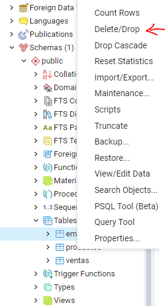
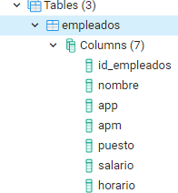

# Curso PostgreSQL

#### Autor: Luis Fernando Apáez Álvarez


##### Eliminación de bases de datos y tablas

En la clase pasada vimos la sintaxis para crear una tabla, la cual básicamente es

```sql
CREATE TABLE <<nombre de la tabla>>(
	<<nombre columna 1>> <<tipo de dato>>,
    <<nombre columna 2>> <<tipo de dato>>,
    .
    .
    .
    <<nombre columna n>> <<tipo de dato>>
);
```

Para esta clase crearemos una tabla de prueba, la cual será posteriormente eliminada. Así, usamos

```sql
CREATE TABLE prueba(
	id_prueba SERIAL,
	nombre_prueba VARCHAR,
	fecha DATE
);
```

la cual, como ya sabemos, se mostrará dentro del esquema público en la parte de _Tables_


---

##### Nota

Los bloques de código que colocamos como:

```sql
-- este es un bloque de código
```

en las clases harán referencia directa al _Query tool_ de _pgAdmin_. Esto es, si nosotros escribimos algo como

```sql
SELECT * FROM productos;
```

ese mismo código es el que debes escribir en el _Query tool_ de tu _pgAdmin_.

---

Una vez creada nuestra tabla de prueba procedemos a eliminarla, lo cual se consigue con la siguiente sintaxis

```sql
DROP TABLE prueba;
```

donde la ejecución ha sido exitosa


Luego, puede que sigamos viendo la tabla dentro del esquema público. Para actualizarlo damos click derecho en _public_ y después click en _Refresh_


con lo cual deberías de conseguir que las únicas tablas que se muestran son las que creamos la clase pasada


Otra alternativa para eliminar una tabla es ir directamente a ella en el esquema público y pulsar click derecho, después seleccionamos la opción que dice _Delete/Drop_ 



Así, tendremos dos opciones cuando queramos eliminar una tabla: una, utilizando código SQL y la otra yendo a las opciones que nos brinda _pgAdmin_ al dar click derecho en la tabla en cuestión.

De hecho, para eliminar una base de datos procederíamos a ir a dicha base y pulsar click derecho, después seleccionaríamos la opción _Delete/Drop_


##### Modificación de una tabla

Supongamos que en la tabla ``empleados``


olvidamos colocar la columna ``horario``. Si bien podríamos eliminar dicha tabla y después volverla a crear agregando la columna que nos faltó, este método después sería inconcebible pues imagines que dicha tabla cuenta ya con mil filas, entonces al eliminar la tabla perderíamos toda la información. 

Para **modificar una tabla y agregar una columna** nueva utilizamos la siguiente sintaxis

```sql
ALTER TABLE <<nombre tabla>> ADD COLUMN <<nombre columna nueva>> <<tipo de dato>>;
```

Así, para agregar la columna ``horario`` a la tabla ``empleados`` escribimos

```sql
ALTER TABLE empleados ADD COLUMN horario VARCHAR;
```

Para ver los cambios, como ya sabemos, vamos a la tabla ``empleados`` y damos click derecho, después pulsamos ``Refresh``, con lo cual deberíamos de ver



ya la columna ``horario``.

Podemos **eliminar** también **columnas** de una tabla. Para ejemplificar la eliminación de una columna, agregaremos primero otra columna nueva a la tabla ``empleados``

```sql
ALTER TABLE empleados ADD COLUMN prueba DATE;
```

Así, eliminamos esta última columna escribiendo

```sql
ALTER TABLE empleados DROP COLUMN prueba; 
```

Luego, podemos **cambiar  el nombre** tanto de las tablas como de las columnas. Para cambiar el nombre de las tablas empleamos

```sql
ALTER TABLE <<nombre tabla>> RENAME TO <<nuevo nombre tabla>>;
```

y para cambiar el nombre de una columna

```sql
ALTER TABLE <<nombre tabla>> RENAME COLUMN <<nombre columna>> TO <<nuevo nombre columna>>; 
```

Finalmente, podemos **cambiar el tipo de dato de una columna**. Esto no es recomendable hacerlo después, pues imaginemos que en la tabla ``empleados`` en la columna ``salario`` tenemos entradas como 8500.0, 15,250.80, etcétera; después, si cambiamos el tipo de dato de ``salario`` de ``REAL`` a ``INT`` (por ejemplo) entonces _postgres_ nos marcará un error. Así, si deseamos cambiar el tipo de dato de una columna, lo mejor es hacerlo en estas instancias en las que no hemos ingresado información a nuestras tablas. Además, es preciso mencionar que siempre debemos planificar bien la estructura de nuestras bases de datos, algo así a lo que hicimos en la clase pasada donde primero describimos brevemente cada columna de la tabla ``productos`` e incluimos el tipo de dato que le asignaríamos a cada una.

Ahora, para cambiar el tipo de dato de una columna utilizamos la siguiente sintaxis

```sql
ALTER TABLE <<nombre tabla>> ALTER COLUMN <<nombre columna>> SET DATA TYPE <<tipo de dato>>;
```

 

---

##### Ejercicios

1. Crea una tabla nueva en el proyecto de la papelería con al menos 4 columnas

   a. Cambia en el nombre de dos columnas de dicha tabla

   b. Cambia el tipo de dato de una columna

   c. Elimina una columna

   d. Cambia el nombre de la tabla

   e. Finalmente, elimina la tabla.

Te recomiendo escribir en un script todo el código del ejercicio anterior e irlos guardando en algún folder de tu pc. 

Para descargar el script SQL de _pgAdmin_ nos vamos a _Save As_ en:


Es importante saber la ruta donde deseas guardar el script SQL. Una vez que pulsamos en _Save As_ se abrirá la siguiente pestaña


donde

1. Colocamos la ruta donde guardaremos nuestro archivo.
2. Agregamos al final de la ruta el nombre que deseamos ponerle a nuestro archivo, en nuestro caso colocamos _Clase3.sql_. Es importante colocar la terminación .sql el final del nombre de nuestro archivo.
3. Finalmente pulsamos ``Create``.


Recuerda también que puedes hallar el código sql completo de cada clase en el repositorio del curso en github. 


[Regresar](index.md)
