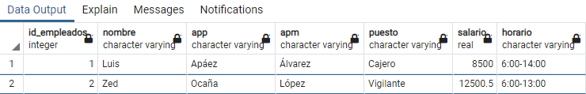

# Curso PostgreSQL

#### Autor: Luis Fernando Apáez Álvarez


##### Lenguaje de definición de datos (DDL: _Data Definition Languaje_)

Dentro del lenguaje SQL tenemos un sublenguaje denominado DDL el cual nos permite **definir** estructuras que almacenarán datos así como funciones que permitan consultarlos. Las sentencias que ocupamos en el DDL son:

``CREATE``: Lo utilizamos para crear bases de datos, tablas, funciones, vistas, etcétera. 

``ALTER``: Lo utilizamos para modificar la estructura. Por ejemplo añadir o modificar columnas, cambiar el nombre de tablas o columnas, etcétera.

``DROP``: Nos permite eliminar objetos de la estructura. Por ejemplo, podemos eliminar bases de datos o tablas.

Así, si nos damos cuenta, en clases pasadas hemos estado utilizando el _lenguaje de definición de datos_ en nuestro código sql.

Existen varios tipos de sublenguajes como el DDL, en esta clase sólo abordaremos otro sublenguaje el cual es el DML (_Data Manipulation Languaje_)

##### Lenguaje de manipulación de datos (DML)

Como bien dice el nombre, este sublenguaje se utiliza para manipular los datos de nuestra base de datos. Podemos consultar nuestros datos, insertar datos nuevos a las tablas, modificar los valores de los datos ya ingresados y también borrarlos. De tal manera, en el lenguaje DML utilizamos las sentencias

``SELECT``: nos permite realizar consultas de nuestros datos

``INSERT``: nos permite insertar valores a nuestra base de datos (BD)

``UPDATE``: nos permite modificar los datos ya ingresados en la BD

``DELETE``: nos permite eliminar filas de las tablas de la BD

En esta clase trabajaremos con cada una de las sentencias mencionadas anteriormente.


###### Inserciones de datos

Comenzaremos por ingresar información a nuestra base de datos. Para ello comenzaremos por ingresar la información en la tabla empleados. Para ello debemos saber bien cuáles son las columnas que la conforman y el tipo de dato que aceptan, pues si ingresamos (por ejemplo) un número real en una columna que admite enteros entonces _postgres_ nos marcará error.


Por consiguiente, ingresaremos la información de un primer empleado utilizando el siguiente código

```sql
INSERT INTO empleados(nombre, app, apm, puesto, salario, horario) VALUES ('Luis', 'Apáez', 'Álvarez', 'Cajero', 8500.0, '6:00-14:00'); 
```

recordemos que las cadenas de texto, en particular del tipo ``varchar``, deben ir entre comillas simples; además, recordemos que la columna horario acepta datos del tipo cada, por ello el horario lo hemos colocado entre comillas simples, además el salario es de tipo ``real``, por ello colocamos 8500.0.

Notemos donde colocamos el nombre de las columnas que omitimos la columna ``id_empleados`` pues el tipo de dato con el cual lo definimos es ``serial`` el cual es un incremento automático partiendo del uno, es decir, el ``id_empleados`` igual a 1 le corresponde al empleado que acabamos de registrar. Si registramos la información de otro empleado, entonces su ``id_empleados`` será el número 2 y así consecutivamente.

De tal manera, la sintaxis general para ingresar datos a nuestras tablas es la siguiente: 

```sql
INSERT INTO <<nombre tabla>> (<<columna 1>>, <<columna 2>>,..., <<columna n>>) VALUES
(<<valor columnas 1>>, <<valor columna 2>>,...,<<valor columna n>>);
```

Asimismo, podemos ingresar información solo en algunas columnas de una tabla. Por ejemplo, pudimos haber ingresado sólo el nombre del empleado en la tabla ``empleados`` escribiendo

```sql
INSERT INTO empleados(nombre) VALUES ('Luis'); 
```

o solo ingresar un salario en una fila de la tabla, sin especificar otra cosa

```sql
INSERT INTO empleados(salario) VALUES (4500.5); 
```

Recapitulando, hasta el momento sólo hemos ingresado un empleado a nuestra tabla ``empleados``. Para ver la información que hemos ingresado en esta tabla haremos uso de las **consultas**. Para los fines de este tema sólo veremos la consulta más sencilla de todas, la cual nos permite ver toda nuestra tabla. Para efectuar una consulta que nos arroje toda la información de la tabla escribimos

```sql
SELECT * FROM <<nombre de la tabla>>;
```

 De tal manera, en nuestro caso escribimos

```sql
SELECT * FROM empleados;
```

lo cual nos arroja al ejecutarlo lo siguiente:


donde puede verse que en automático se ha puesto el número 1 en el ``id_empleados``, además podemos ver los nombres de las columnas y el tipo de dato que admiten. 

Ahora, ingresemos el siguiente empleado omitiendo algunas columnas

```sql
INSERT INTO empleados(nombre, app, apm, horario) VALUES ('Zed', 'Ocaña', 'López', '6:00-13:00');

-- Después realizamos nuevamente una consulta
SELECT * FROM empleados;
```


donde puede verse que en las columnas donde no ingresamos información se ha colocado en automático la etiqueta ``null``. En muchas ocasiones, tener valores nulos no es lo más óptimo en una base de datos, en algunos otros caso no hay otra alternativa. Como en nuestro caso, el tener el registro de un empleado sin tener especificado el puesto que cubre no puede ocurrir, entonces ingresaremos la información que nos falta referente al empleado Zed. Para ello haremos uso de la sentencia ``UPDATE``. La sintaxis básica es

```sql
UPDATE <<nombre tabla>> SET <<nombre columna>> = <<valor correspondiente>> WHERE <<condición>>;
```

En nuestro caso queremos cambiar los valores nulos de las columnas ``puesto`` y ``salario`` referente al empleado Zed (cuyo ``id_empleados`` es igual a 2), donde pondremos en su lugar ``Vigilante`` y ``12500.5`` respectivamente. Para ello 

* Opción 1:

```sql
UPDATE empleados SET puesto = 'Vigilante' WHERE id_empleados = 2;
```

estamos colocando en la columna ``puesto`` el valor ``'Viglante'`` en el empleado cuyo ``id_empleados`` es igual a 2, es decir, estamos actualizando la información de Zed. También, en vez de utilizar al final ``WHERE id_empleados = 2`` pudimos haber utilizado ``WHERE nombre = 'Zed'``, sin embargo, si en nuestra tabla tuviéramos dos empleados con el mismo nombre entonces tendríamos un problema. De ahí la importancia de tener un identificador único en cada tabla, que en este caso es el ``id_empleados``. Procedemos a agregar el salario también

```sql
UPDATE empleados SET salario = 12500.5 WHERE id_empleados = 2;
```

* Opción 2 (recomendable):

En vez de realizar dos ``UPDATES`` podemos simplemente efectuar uno en la misma sentencia colocando una coma de separación entre cada columna:

```sql
UPDATE empleados SET puesto = 'Vigilante', salario = 12500.5 WHERE id_empleados = 2;
```

o de manera más estética podemos escribir lo anterior como

```sql
UPDATE empleados 
SET puesto = 'Vigilante',
	salario = 12500.5
WHERE id_empleados = 2;
```

y realizamos una consulta para ver los cambios

```
SELECT * FROM empleados;
```



donde ya no tenemos los valores nulos que teníamos antes.

Continuando, ingresemos el siguiente "empleado":

```sql
INSERT INTO empleados(nombre, app, apm, puesto, salario, horario) 
	VALUES('ññ', 'ñ', 'uwu', 'ñe', 2.5, 'ññ')
```

la cual no tiene ningún sentido pero nos ayudará a utilizar la sentencia ``DELETE``. Una vez que consultamos la tabla


procedemos a eliminar la fila 3 con los datos que no tienen sentido, para ello escribimos

```sql
-- Recordemos que queremos eliminar la fila 3
DELETE FROM empleados WHERE id_empleados = 3;
```

y después consultamos para ver que la fila 3 ya no está en la tabla ``empleados``


En conjunto ya hemos abordado las 4 sentencias de las que hablamos sobre el _lenguaje de manipulación de datos (DML)_.

---

##### Ejercicios

1. En la clase 2 definimos las primeras tres tablas de nuestra base de datos. De hecho, omitimos la definición de una columna en la tabla ``productos``. Pues dicha tabla la definimos empleando el código

   ```sql
   CREATE TABLE productos(
       id_productos SERIAL,
       cantidad_almacen INT,
       precio REAL);
   ```

   y nos faltó la columna ``nombre_producto`` cuyo tipo de dato es ``VARCHAR``. De tal manera, utiliza lenguaje DDL para agregar dicha columna a la tabla ``productos``.

2.  Realiza al menos tres inserciones en cada una de las tablas que tengas en tu base de datos (referente al proyecto de la papelería)

3. Elimina dos filas de cualquiera de las tablas

4. Modifica el valor de un registro por cada tabla de tu base de datos. 


[Regresar](index.md)
