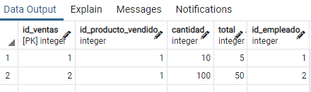

# Curso PostgreSQL

##### Autor: Luis Fernando Apáez Álvarez


##### LLave foránea

En la clase 4 se dejo como ejercicio realizar al menos 3 inserciones en cada tabla presente en tu base de datos (referente al proyecto de la papelería). Tal vez notaste que existe una relación entre todas las tablas (de hecho es así, todas las tablas de nuestra base de datos deben relacionarse), puesto que estamos trabajando con bases de datos relacionales (aunque no lo hayamos dicho hasta ahora). Sin entrar en detalles, se denomina bases de datos relacionales a aquellas que cumplen con el modelo relacional y donde todas las relaciones (o también conocidas como tablas) están conectadas.

Considerando las tablas ``empleados, ventas`` y ``productos`` podemos notar que

* ``empleados`` está relacionada con ``ventas`` pues tenemos una columna denominada ``empleado`` en la tabla ``ventas``.
* ``ventas`` está relacionada con ``productos`` pues tenemos una columna denominada ``producto_vendido`` en la tabla ``ventas``.

Con base en lo anterior, las tres tablas mencionadas estás relacionadas entre sí.

Luego, debe parecer lógico que un producto vendido este previamente declarado en la tabla productos, pues no podemos vender un producto del cual no tenemos registro. De tal manera, implícitamente tenemos una restricción sobre la columna ``producto_vendido`` de la tabla ``ventas``, además, nos gustaría que en dicha columna no podamos ingresar valores que no estén previamente registrados en la columna ``nombre_producto`` de la tabla ``productos``. Para ello haremos uso de las **llaves foráneas** (o Foreign key) la cual se define como una restricción referencial o de integridad, y justamente funciona para colocar una limitación a la hora de ingresar valores a una columna (o columnas).

Por ende, utilizaremos una **llave foránea** sobre la columna ``producto_vendido`` para imponer una restricción referencial a partir de la columna ``nombre_producto`` de la tabla ``productos``. Es decir, estaremos imponiendo que todos los valores que sean ingresados en la columna ``producto_vendido`` de la tabla ``ventas`` estén previamente registrados en la columna ``nombre_producto`` de la tabla ``productos``.

Por ejemplo, supongamos que ingresamos los siguientes datos

```sql
INSERT INTO productos(nombre_productos, cantidad_almacen, precio) 
	VALUES('Pluma negra', 1000, 0.5);
INSERT INTO productos(nombre_productos, cantidad_almacen, precio) 
	VALUES('Cuaderno blanco', 800, 20.9);
	
SELECT * FROM productos;
```


Recordemos de clases pasada que ya habíamos ingresado algunos empleados en la tabla ``empleados``

```sql
SELECT * FROM empleados; 
```


y después ingresamos los siguientes datos en la tabla ``ventas``:

```sql
INSERT INTO ventas(producto_vendido, cantidad, total, empleado) 
	VALUES('Pluma negra', 10, 5, 'Luis');
INSERT INTO ventas(producto_vendido, cantidad, total, empleado) 
	VALUES('Engrapadora', 1, 55.5, 'Zed');

-- Consultamos
SELECT * FROM ventas;
```


Sin problema alguno pudimos ingresar la información anterior, no obstante, hemos "vendido" un producto que no tenemos registrado en la tabla ``productos``, lo cual representa un error grave para nuestro negocio pues no tenemos un correcto control sobre los productos que ofrecemos, lo cual puede representar pérdidas para el negocio. Por otro lado, vemos que en la columna ``empleado`` hemos colocado el nombre de un empleado, el cual está previamente registrado en la tabla ``empleados``, así, en dicha columna estamos haciendo una correcta referencia.

Vemos que la referencia entre la tabla ``empleados`` y ``ventas`` es correcta, pero la referencia de la tabla ``productos`` y la tabla ``ventas`` no lo es. Lo anterior no podemos dejarlo "a la suerte" de quién ingresa la información, es decir, no podemos esperar que en algunas ocasiones la referencia con otras tablas sea correcta y en otros casos incorrecta. De tal manera, al definir la restricción de **llave foránea** en la columna ``producto_vendido`` de la tabla ``ventas``con la columna ``nombre_producto`` de la tabla ``productos`` garantizamos que la referencia entre dichas columnas sea siempre correcta. Supongamos que ya definimos la llave foránea entre estas dos tablas, entonces, si ingresamos un producto vendido que no está previamente registrado en la tabla ``productos``, entonces _postgres_ nos arrojará un error referencial y no permitirá que se ingrese la información que pretendíamos ingresar. Así, también debemos definir una llave foránea entre las tablas ``ventas`` y ``empleados`` para que en la columna ``empleado`` de la tabla ``ventas`` tengamos sólo empleados previamente registrados en la tabla ``empleados``.


De tal manera, la **llave foránea** se compone de dos tablas, una se conoce como tabla de referencia y la otra como tabla referenciada. En nuestro ejemplo tenemos que

| Tabla referenciada | Tabla de referencia |
| ------------------ | ------------------- |
| ``empleados``      | ``ventas``          |
| ``productos``      | ``ventas``          |

donde la **llave foránea** se define sobre  la tabla de referencia. Entonces, para definir una **llave foránea** requerimos de una columna (o columnas) de la tabla de referencia y una columna (o columnas) de la tabla referenciada, donde la columna (o columnas) de la tabla referenciada debe tener la restricción de **llave primaria**.

Con base en lo anterior tendríamos un problema pues nosotros tenemos que

| Tabla referenciada                          | Tabla de referencia                      |
| ------------------------------------------- | ---------------------------------------- |
| ``empleados``: columna ``nombre``           | ``ventas``: columna ``empleado``         |
| ``productos``: columna ``nombre_productos`` | ``ventas``: columna ``producto_vendido`` |

las columnas de las tablas referenciadas no son llaves primarias en sus respectivas tablas, pues las llaves primarias las definimos sobre los id's. La solución del problemas sería considerar en la tabla ``ventas`` que las columnas ``producto_vendido`` y ``empleado`` reciban números enteros que hagan alusión a los id's del producto y de los empleados respectivamente.

Esto es, consideraremos algo como

| id_ventas | producto_vendido | cantidad | total | empleado |
| --------- | ---------------- | -------- | ----- | -------- |
| 1         | 1                | 10       | 5     | 1        |
| 2         | 1                | 100      | 50    | 2        |

donde le producto venido 1 hace referencia a aquel que tenga el id igual a 1 en la tabla ``productos``; el empleado con id igual a 1 sabemos que es Luis, el empleado con id igual a 2 sabemos que es Zed. De esta forma conseguimos un equivalente a lo que teníamos anteriormente


pero ahora tenemos todo lo necesario para definir las llaves foráneas que queremos.

Para conseguirlo, la manera más fácil (y la cual podemos hacer pues tenemos muy pocos datos) es eliminar y crear nuevamente la tabla ``ventas`` colocando el tipo de dato correcto en las columnas ``producto_vendido`` y ``empleado``, pues recordemos que las habías definido con tipo de dato ``VARCHAR`` por lo que no podrá recibir número enteros, en cambio, al definir dichas columnas con el tipo de dato ``int`` tendremos el problema resuelto. Para ello escribimos

```sql
-- Eliminamos la tabla ventas
DROP TABLE ventas;

-- Creamos la tabla ventas
CREATE TABLE ventas(
	id_ventas SERIAL,
	id_producto_vendido INT,
	cantidad INT,
	total INT,
	id_empleado INT,
	PRIMARY KEY(id_ventas)
);
```

Ahora bien, antes de ingresar información a nuestra nueva tabla ``ventas`` definiremos las llaves foráneas de las que hemos estado hablando. Antes, veamos que

| Tabla referenciada                      | Tabla de referencia                         |
| --------------------------------------- | ------------------------------------------- |
| ``empleados``: columna ``id_empleados`` | ``ventas``: columna ``id_empleado``         |
| ``productos``: columna ``id_productos`` | ``ventas``: columna ``id_producto_vendido`` |

de donde escribimos

```sql
-- FK (llave foránea) entre la tabla ventas y empleados
ALTER TABLE ventas ADD CONSTRAINT fk_ventas_id_empleado_id_empleados
	FOREIGN KEY (id_empleado) REFERENCES empleados(id_empleados);
	
-- FK entre la tabla ventas y productos
ALTER TABLE ventas ADD CONSTRAINT fk_ventas_id_producto_vendido_id_productos
	FOREIGN KEY (id_producto_vendido) REFERENCES productos(id_productos);
```

donde la sintaxis general es

```sql
ALTER TABLE <<tabla referencia>> ADD CONSTRAINT fk_<<columna referencia>>_<<columna referenciada>> 
FOREING KEY (<<columna referencia>>) REFERENCES <<tabla referenciada>>(<<columna referenciada>>);
```

Vemos que las llaves foráneas aparecen en el menú de la izquierda en la parte de ``constraints``


Ahora si, ingresamos información a nuestra tabla ``ventas``

```sql
INSERT INTO ventas(id_producto_vendido, cantidad, total, id_empleado) VALUES(1, 10, 5, 1);
INSERT INTO ventas(id_producto_vendido, cantidad, total, id_empleado) VALUES(1, 100, 50, 2);

-- Consultamos
SELECT * FROM ventas;
```



Ahora, si intentamos agregar un producto no registrado en la tabla de ventas nos marcaría un error. Por ejemplo, como en la tabla ``productos`` sólo tenemos dos productos, ingresemos el id igual a 3 (el cual no existe previamente en la tabla ``productos``) en la tabla ``ventas`` 

```sql
INSERT INTO ventas(id_producto_vendido, cantidad, total, id_empleado) VALUES(3, 100, 50, 2);
```


---

##### Ejercicio

1. De acuerdo a la relación de las tablas en tu base de datos (referente al proyecto de la papelería), define las llaves foráneas que sean necesarias. Para ello, si es necesario, tendrás que eliminar y volver a crear tablas para que se acoplen a la definición de las llaves foráneas (como se hizo en clase con la tabla ``ventas``).
2. Una vez hecho el punto uno, realiza en cada tabla de tu base de datos al menos tres inserciones.


[Regresar](index.md)
