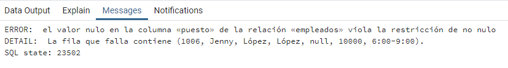

# Curso PostgreSQL

##### Autor: Luis Fernando Apáez Álvarez


##### Restricciones

Desde hace dos clase hemos estado trabajando con las restricciones sobre nuestras tablas. Dichas restricciones fueron especificamente las _llaves primarias_ y _foráneas_, las cuales son de enorme importancia para maneter la integridad de los datos en nuestra BD; asimismo, las restricciones que veremos en esta clase son útiles para maneter dicha integridad.

###### Restricción ``CHECK``

Comencemos por ver los primeros registros de la tabla ``empleados``:


y supongamos, por ejemplo, que por políticas de la empresa ningún empleado puede ganar más de 65000 mensuales. Así como hemos construido nuestra tabla no tendríamos problema alguno en ingresar un empleado cuyo salario exceda esta cifra. Por ello es necesario la implementación de una restricción sobre esta columna para impedir que se ingresen valores superiores a los 65000, lo cual conseguiremos al definir la restricción del tipo ``CHECK`` sobre al columna ``salario``, de modo que con esta retricción logramos controlar los valores que se ingresan en una columna en especifico. 

Para agregar dicha restricción escribimos:

```sql
ALTER TABLE <<nombre_tabla>> ADD CONSTRAINT ck_<<nombre_tabla>>_<<nombre_columna>> CHECK (<<condicion>>)
```

donde notamos que en el ``CHECK`` debemos definir alguna condición en especifico. En nuestro ejemplo, la condición sería que ``salario < 65000``. Por consiguiente, definimos el siguiente ``CHECK`` sobre la columna ``salario``:

```sql
ALTER TABLE empleados ADD CONSTRAINT ck_empleados_salario CHECK(salario < 65000);
```

cuando lo ejecutemos probablemente nos salga un error que nos diga que dicha restricción es violada por algunos registros en nuestra tabla, es decir, ya existen empleados que ganan más de 65000. En mi caso sólo hay un empleado y éste es:

```sql
SELECT * FROM empleados WHERE salario > 65000;
```


cuyo salario es exorbitante. Recordemos que los datos los generamos de amnera aleatoria, por lo que casos como estos se nos presentan. Se puede solucionar fácilmente este problema si actualizamos el valor del salario para este empleado:

```sql
UPDATE empleados SET salario = 60000 WHERE id_empleados = 80; 
```

nuevamente ejecutamos el código para definir el ``CHECK`` y ahora no deberíamos tener problemas. Ahora bien, ya hemos definido la restricción ``CHECK`` sobre la columna ``salarios``, de esta forma, si intentaramos ingresar un empleado nuevo o actualizar los datos de un empleado y colocar en la columna ``salario`` un valor mayor a los 65000 obtendríamos seguramente un error. Comprebemos lo dicho anteriromente

```sql
INSERT INTO empleados(nombre, app, apm, puesto, salario, horario) 
	VALUES('Jenny', 'López', 'López', 'Vendedor', 70000, '7:00-10:00'); 
```

con lo que obtenemos


un error. Así, estamos garantizando que los registros de la tabla ``empleados``, en especifico los valores de la columna ``salario``, mantenga una integridad de acuerdo a nuestra necesidades. Otro ejemplo de la restricción ``CHECK`` es en campos referentes al _sexo_. Supongamos que en la tabla ``empleados`` tenemos una columna destinada al _sexo_ del empleado; para esta columna podríamos definir una restricción ``CHECK`` de la siguiente forma

```sql
ALTER TABLE empleados ADD CONSTRAINT ck_empleados_sexo 
	CHECK(sexo IN ('Masculino', 'Femenino', 'Otro'))
```

donde sólo estamos premitiendo que los valores de la tabla ``empleados`` en la columna  ``sexo`` sean _Masculino, Femenino_ u _Otros_. Así, si llegaramos a ingresar _hombre_, entonces se nos arrojaría un error. 

Otro ejemplo común es agregar una restricción ``CHECK`` sobre columnas de números telefónico. Por ejemplo, supongamos que tenemos la columna ``num_tel`` en la tabla ``empleados`` y deseamos que no sean ingresados números telefónicos con más de 10 cifras, o que lleguen a ingresarse números telefónicos con alguna letra. Entonces emplearemos la siguiente restricción ``CHECK`` sobre la columna ``num_tel``

```sql
ALTER TABLE empleados ADD CONSTRAINT ck_empleados_num_tel 
	CHECK(num_tel ~ '[0-9][0-9][0-9][0-9][0-9][0-9][0-9][0-9][0-9][0-9]') 
```

donde especificamos que el número telefónico debe ser de 10 cifras y cada una de estas cifras será un entero entre el 0 y el 9, además es necesario colocar el símbolo ``~`` después del nombre de la columna a la cual le aplicares la restricción ``CHECK``. También podemos utilizar _intervalos de letras_ en vez de numéricos (enteros), por ejemplo ``'[A-Z][A-Z]'`` indicaría que se debe escribir una palabra conformada de dos letras mayúsculas entre la A y la Z.

Ahora bien, podemos eliminar restricciones ``CHECK``; por ejemplo eliminemos la restricción ``ck_salario`` de la tabla ``empleados``

```sql
ALTER TABLE empleados DROP CONSTRAINT ck_empleados_salario;
```

es decir, la sintaxis general para eliminar una restricción ``CHECK`` es

```sql
ALTER TABLE <<nombre_tabla>> DROP CONSTRAINT ck_<<nombre_tabla>>_<<nombre_columna>>;
```

###### Restricción ``NOT NULL``

Hay veces en las que no podemos permitir valores nulos dentro de una columna. Por ejemplo, en la tabla ``empleados``, en la columna ``puesto`` debemos especificar para cada uno de los empleados el puesto que éstos llevarán a cabo. Así, de manera general, la restricción ``NOT NULL`` nos sirve para forzar el ingreso de datos para ciertas columnas.

Para definir esta restricción sobre la columna ``puesto`` escribimos 

```sql
ALTER TABLE empleados ALTER COLUMN puesto SET NOT NULL;
```

de tal manera, si nosotros intentamos registrar a un empleado nuevo y omitimos el valor correspondiente a la columna ``puesto``, entonces _postgres_ nos arrojará un error:

```sql
INSERT INTO empleados(nombre, app, apm, salario, horario) 
	VALUES('Jenny', 'López', 'López', 10000, '6:00-9:00');
```



###### Restricción ``unique``

Como vimos en la restricción de _llave primaria_ al definirla sobre una columna, dentro de esta columna no se aceptarán valores repetidos. Es decir, si definimos la llave primaria, por ejemplo, sobre el ``id_empleados`` de la tabla ``empleados``, entonces no se pirmitirán id's repetidos.

La restricción ``unique`` actúa de manera muy similar, pues al definir ésta sobre alguna columna, no se permitirán valores duplicados. Sin embargo, dicha columna no tiene la características principales para ser considerada como llave primaria dentro de esta tabla y además ésta permite valores nulos (lo cual la llave primaria no permite). Por ejemplo, si en la tabla ``empleados`` tuvieramos una columna denominada ``curp``, entonces sería necesario definir la restricción ``unique`` para dicha columna, lo cual conseguiríamos escribiendo

```sql
ALTER TABLE empleados ADD CONSTRAINT uq_empleados_curp UNIQUE(curp);
```


_Observación:_ El proceso que estamos siguiendo para definir las restricciones no es el mejor, si bien es ilustrativo, éste debe realizarse desde que definimos las tablas y no después como lo estamos haciendo ahora.  De tal manera, lo primero que se debe hacer en un proyecto es pensar las tablas que se crearán, pensar las columnas de cada tabla y definir las restricciones sobre las columnas que sean necesarias.

Por ende, la forma en la que estamos llevando el curso es, primero, aprender el código SQL y, después, sobre la marcha ir modificando el proyecto, lo cual es bastante ilustrativo y práctico; sin embargo no es la forma correcta de trabajar, pero, una vez que finalices el curso tendrás de igual manera las herramientas que te peritan trabajar con proyectos de la mejor forma posibble.


---

###### Ejercicio

1.  Dentro de la tabla ``productos`` tenemos distintos productos que vendemos en la papelería. Use el siguiente código 

   ```sql
   SELECT DISTINCT nombre_productos FROM productos;
   ```

   para conocer todos los productos que se venden en la papelería. 

   ​	a. Define una restricción ``CHECK`` sobre la columna ``nombre_productos`` de la tabla ``productos``,   	basándote en la información que obtuviste de la consulta anterior.

   ​	b. Intenta ingresar un registro que viole la restricción creada en el punto anterior. 

   ​	c. Elimina la restricción creada en el punto a. 

2.  Elige cualquiera de tus tablas y coloca una restricción de no nulidad en alguna de sus columnas, así como una restricción ``UNIQUE``
