# Curso PostgreSQL

##### Autor: Luis Fernando Apáez Álvarez


##### Realizando 1000 inserciones

Hasta el momento, al menos en las tres tablas que trabajamos en clase (``empleados, ventas`` y ``productos``) ya hemos definidos las principales restricciones: las llaves primarias y foráneas. Con lo anterior garantizamos la integridad de nuestros datos y evitamos errores a la hora de ingresar información en cada una de ellas.

Ahora bien, para trabajar de la mejor forma en clases posteriores ingresaremos bastantes filas a nuestras tres tablas base (las que mencionamos antes), lo que nos permitirá introducirnos a manejar bases de datos con muchos registros. Realizaremos pues 1000 inserciones en las tablas ``empleados, ventas`` y ``productos``,   pero no ingresaremos de forma manual todas esta información, nos auxiliaremos de la página [mockaroo](https://www.mockaroo.com/) para generar las 1000 inserciones. En dicha página se creará de forma aleatoria la información que le pidamos, de acuerdo al tipo de dato de las columnas de nuestras tablas.


Una vez en la página de mockaroo veremos algo como

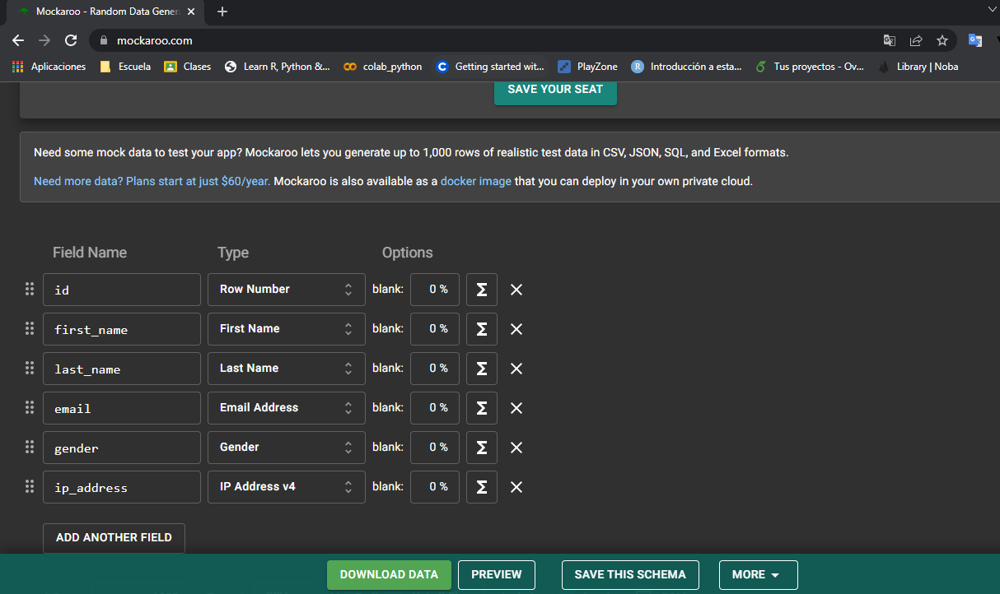

Primero generaremos la información para las tablas ``empleados`` y ``productos``, pues recordemos que en la tabla ``ventas`` hay dos columnas con llaves foráneas que depende de la información de estas primeras dos tablas.

###### Para la tabla ``empleados``.

Comenzamos por realizar una consulta

```sql
SELECT * FROM empleados;
```


con base en lo anterior escribimos en mockaroo

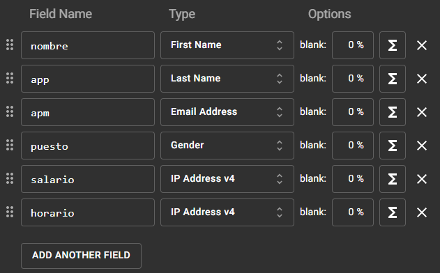

es decir, comenzamos colocando el nombre de las columnas de la tabla. Posteriormente agregamos el tipo de dato que le corresponde

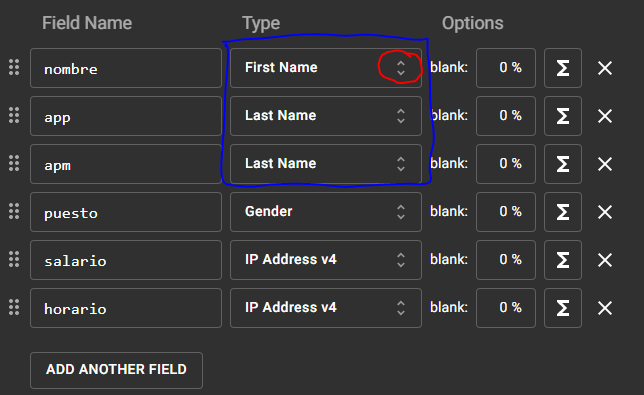

agregamos el tipo de dato para las columnas ``nombre, app, apm`` buscando en el menú que se despliega de pulsar en las flechas (lo que está en color rojo). En la columna ``nombre`` se generarán nombres aleatorios (_first name_) y en las columnas ``app, apm`` se generarán apellidos (_last name_). Después, trabajaremos con las columnas ``salario`` y ``horario``. Para salario, en el menú que se despliega de pulsar la flechas buscaremos la opción _number_

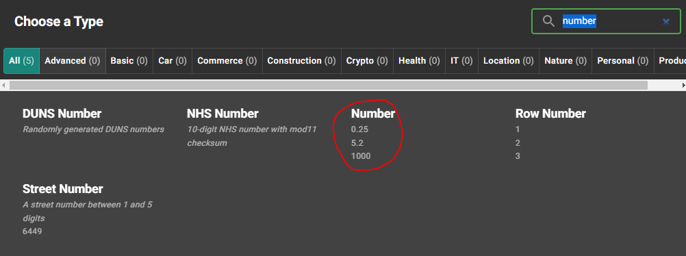

lo que nos arroja


y personalizamos los valores para la columna salario. En nuestro caso colocamos


Después pasamos a la columna ``horario``. Para ello, como le hicimos en la columna anterior,  buscamos _character sequence_, con lo que obtendremos 


y después lo personalizamos como


si tienes dudas de porqué colocamos lo anterior puedes pulsar el símbolo de ayuda y mockaroo arrojará una breve guía


Finalmente, en la columna ``puesto`` utilizaremos un poco de programación, pues en nuestro caso los puestos de trabajo son muy específicos. Supondremos que sólo hay cuatro puestos de trabajo en la papelería: cajero, vendedor, vigilante y limpieza. Para conseguir asignar a cada uno de los 1000 empleados que generaremos un puesto de trabajo haremos lo siguiente:

*  A cada empleado le asignaremos un número de la siguiente forma: al primer empleado de la tabla le asignamos el 1, al segundo el 2, etcétera. Esto lo conseguimos con _row number_:


* Después pulsamos el botón sigma, el cual nos permite escribir código

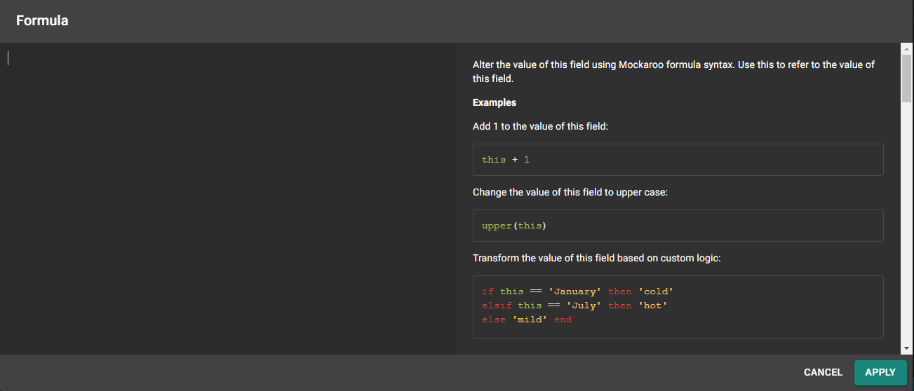

Ahí, la idea será la siguiente:

1. A los primeros 250 empleados, que tienen asignados los números del 1 al 250 en la columna ``puesto`` (lo cual conseguimos al colocar en puesto _row _number_ en mockaroo) les asignaremos el puesto de trabajo de cajero. El código que emplearemos será:

```
if puesto <= 250 then 'cajero'
```

es decir, si el número asignado al puesto es menor o igual a 250 entonces escribiremos en la columna ``puesto`` _cajero_. 

2. A los empleados entre el 250 y 500 les asignaremos el puesto de trabajo de vendedor:

```
elsif puesto <= 500 and puesto > 250 then 'vendedor'
```

Y el resto queda como

```
elsif puesto <= 750 and puesto > 500 then 'vigilante'
else 'limpieza' end
```

En mockaroo tendríamos

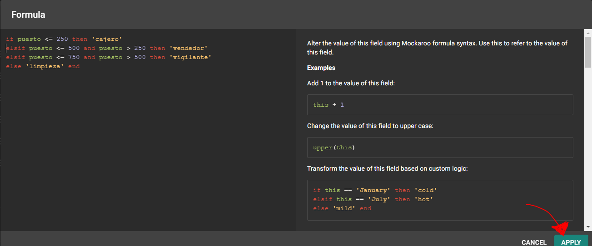

pulsamos _Apply_ para aplicar la fórmula del código que escribimos. Después previsualizamos los datos que se generaron. Para ello, en la pestaña principal pulsamos en _Preview_

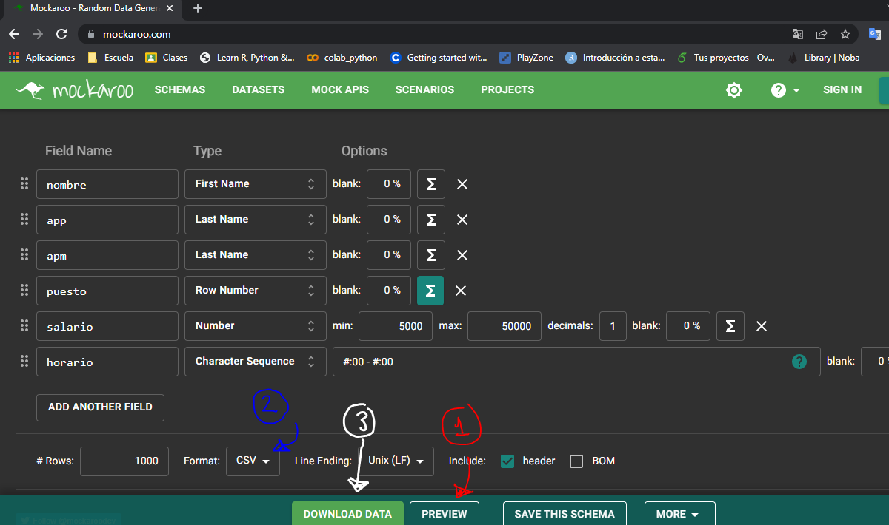

donde:

1. Nos arroja la previsualización de los datos que generamos, en nuestro caso:

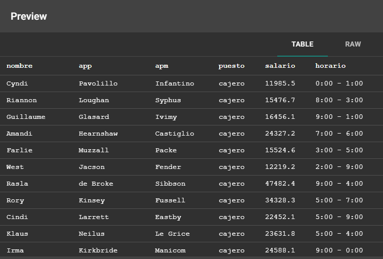

2. Pulsamos en _Format_ y buscamos la opción de _sql_


una vez seleccionada la opción de _SQL_ nos aparecerá una opción a la derecha denominada _Table Name_. En ella eliminamos el texto _MOCK_DATA_ y colocamos el nombre de nuestra tabla, la cual es ``empleados``


 Finalmente:

3. Descargamos el archivo .sql pulsando en _download data_. Es importante saber la ruta donde descargamos dicho archivo.

Ahora bien, realizaremos las 1000 inserciones en la tabla ``empleados``, las cuales tenemos ya en el archivo que descargamos. No obstante, no iremos a _pgAdmin_ para efectuar dichas inserciones pues muy seguramente esto sería muy lento debido al número de inserciones que creamos en el archivo .sql, además podríamos correr el riesgo de que nuestra pc se trabe. Para solucionar esto trabajaremos directamente con postgres. Cabe resaltar que _pgAdmin_ es un cliente postgres, es decir, en él podemos utilizar posgres, siendo así que éste es un intermediario entre el usuario (nosotros) y PostgreSQL.

Para interactuar de manera directa con posgres utilizaremos la consola _psql_ la cual descargamos en conjunto con _pgAdmin_. Para ello iremos al buscador de aplicaciones y escribimos justamente _psql_. Después de abrirlo nos debe arrojar la siguiente ventana


en la cual nos dice que estamos trabajando con el servidor local (nuestra pc). Damos enter y nos debe de aparecer

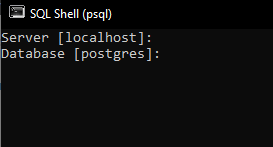

que hace alusión a la base de datos con la cual queremos trabajar. En mi caso, las tablas ``empleados, ventas, productos`` se encuentran en una base de datos denominada _CursoPostgres_, por lo que en

```shell
Database [postgres]:
```

colocaremos _CursoPostgres_. Después damos enter hasta que nos pide la contraseña que registramos en _pgAdmin_

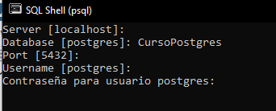

una vez ingresada la contraseña damos enter y nos debería de aparecer algo como

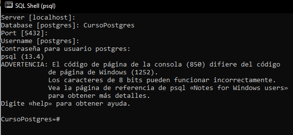

con lo cual hemos logrado realizar la conexión directa con postgres. De hecho, desde dicha consola (y una vez realizada la conexión) podemos utilizar código sql. Por ejemplo, desde la consola podemos realizar una consulta

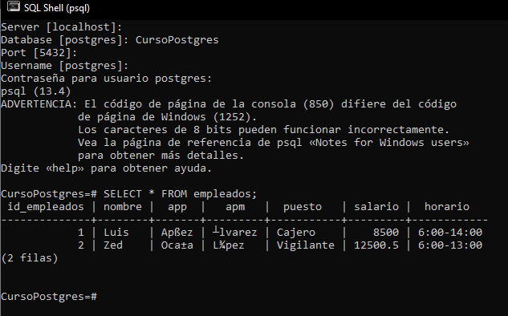 

Ahora bien, cerramos la consola _psql_ y ahora abrimos _símbolos del sistema_. Ahí, escribiremos

```shell
cd C:\Program Files\PostgreSQL\13\bin
```

En mi caso escribí esa dirección, pero puede que en tu pc dicho archivo tenga otra dirrección. Para hallar la dirección debes ir a **archivos>>este equipo>>Disco local>> archivos de programa** y buscar la carpeta PostgreSQL. La abrimos hasta llegar a la carpeta **bin** , abrimos también esta carpeta y copiamos dicha dirección para después pegarla en la consola

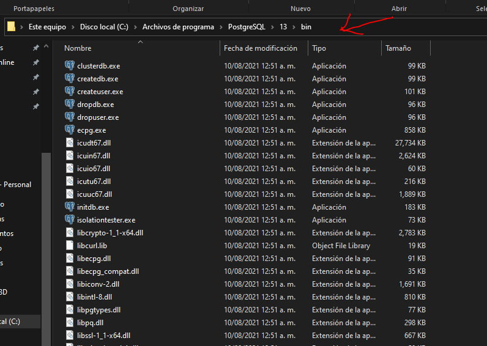


Ahora, en la consola escribimos `` psql -U postgres -d CursoPostgres -f "  "`` donde colocaremos entre las comillas la dirección donde guardamos el archivo .sql que descargamos de mockaroo:

```shell
psql -U postgres -d CursoPostgres -f "C:\Users\weeee\OneDrive\Escritorio\empleados.sql"
```

Note que escribimos ``-d CursoPostgres``, es decir, después de ``-d `` escribimos el nombre de la base de datos que contiene la tabla ``empleados``.

Una vez que damos enter se nos pedirá la contraseña del postgres. Así, cuando damos enter en la contraseña se comenzarán a ejecutar los inserts en la tabla ``empleados``

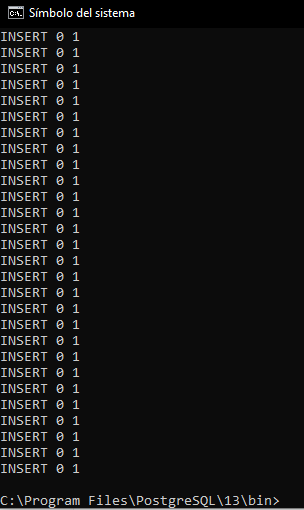

Así, los inserts se han ejecutado. Después veamos los resultados en _pgAdmin_

```sql
-- Realizamos la consulta
SELECT * FROM empleados;
```

Primeras 8 filas:

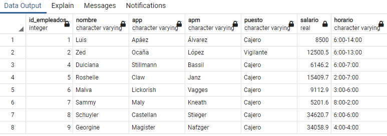

Últimas  filas

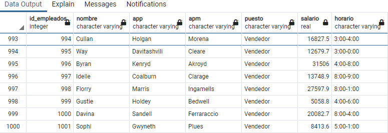

[Regresar](index.md)
